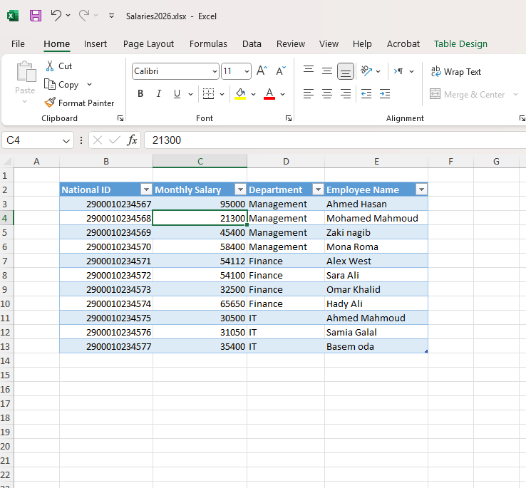
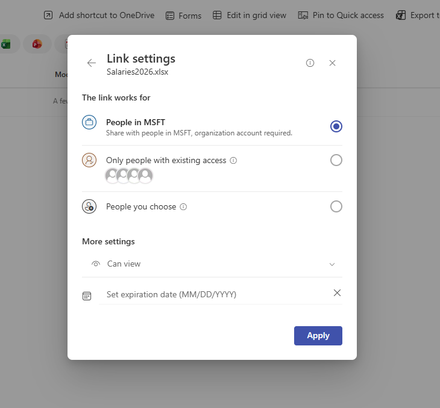
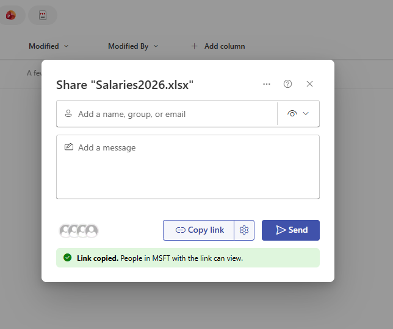
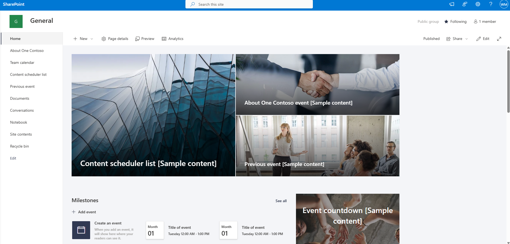
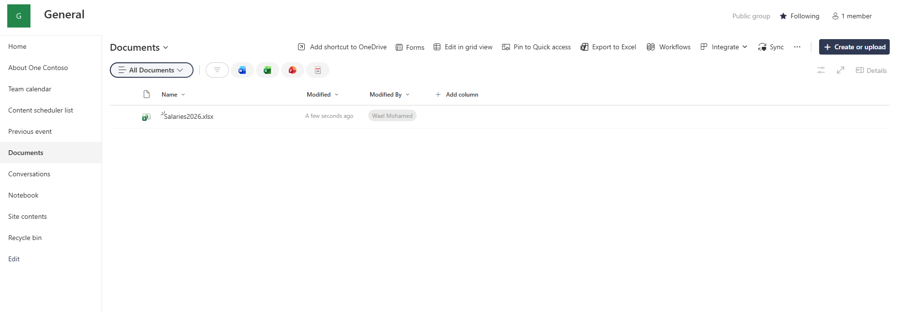

# 🏛️ Copilot Oversharing Risk — Assessment Record (CAR-01)

> ⚠️ **Disclaimer:** All data shown is fictitious and created in an isolated
> Microsoft 365 lab tenant for demonstration purposes only. No real personal,
> employee, or customer data is used.

> **Module:** M1 - Data Security  
> **Lab:** Lab 1 - Oversharing Baseline  
> **Date:** 2026-06-18  
> **Author:** Wael Mohamed  
> **Status:** Completed ✅

---

## 🎯 Context

Microsoft 365 Copilot honors existing Microsoft 365 permissions — meaning that any content unintentionally overshared can become easier to discover through natural-language prompts.

This lab builds and documents a realistic oversharing scenario in a Microsoft 365 E5 lab tenant, reproducing common real-world patterns that may expose sensitive data before a Copilot rollout.

The goal is to demonstrate why organizations should review sharing links, site-level access, and data classification before enabling Microsoft 365 Copilot broadly.

---

## 🎯 Objective

Identify and document high-risk oversharing patterns that could increase exposure risk during a Microsoft 365 Copilot rollout.

This assessment focuses on:

- Org-wide sharing links
- Public SharePoint sites
- Sensitive files without classification
- Copilot readiness risk caused by existing permissions
- Business impact of overshared content

---

## 🧩 Scope

### In Scope

- SharePoint Online oversharing scenario
- Org-wide sharing link exposure
- Public site exposure
- Sensitive sample data without classification
- Copilot readiness risk explanation
- Evidence collection and screenshots

### Out of Scope

- Real user or customer data
- Production tenant assessment
- Full DLP implementation
- Full Microsoft 365 Copilot deployment
- Legal or regulatory compliance opinion
- Full remediation workflow

---

## ⚖️ Constraints

### Budget Constraint

The assessment assumes the organization wants to use existing Microsoft 365 capabilities first before purchasing additional advanced licensing or add-ons.

### Deadline Constraint

A Copilot readiness risk assessment is often required before a planned Copilot pilot, so findings must be clear, evidence-based, and delivered quickly.

### User Resistance

Business users and site owners may resist permission cleanup if they believe broad sharing improves collaboration speed.

### Operational Constraint

SharePoint permissions and sharing links may be owned by different business teams, making remediation dependent on data owners and site owners.

---

## 🪪 License Considerations

### Current Lab License

Microsoft 365 E5 lab tenant.

### E3 Fit

A Microsoft 365 E3 environment can still support basic oversharing assessment activities such as reviewing SharePoint permissions, sharing links, site visibility, and manual governance processes.

### E5 / Add-on Justification

E5 or advanced compliance/security add-ons may be justified when the organization needs stronger capabilities such as advanced data governance, automated detection, advanced DLP, insider risk signals, or deeper audit/compliance workflows.

### Cost Justification

Before recommending E5 broadly, the consultant should first identify the business risk:

- Is sensitive data broadly accessible?
- Are links shared org-wide?
- Are public sites storing sensitive data?
- Is Copilot rollout planned soon?
- Is manual review too slow or incomplete?

If the exposure risk is high and manual controls are insufficient, advanced licensing may be justified for high-risk departments or compliance/security teams.

### Trade-off

Staying on E3 lowers licensing cost but may require more manual discovery, review, and remediation.  
Using E5 or add-ons can improve governance and detection, but requires clear risk-based justification.

---

## 🧩 Approach

Reproduced the three highest-risk oversharing patterns using Microsoft 365 and SharePoint.

| Pattern | Action | Risk Created |
|---------|--------|--------------|
| **Org-wide link** | Shared `Salaries2026.xlsx` via *People in org* link | Every employee can view confidential salaries |
| **Public site** | Converted `General` site to **Public group** | Sensitive content exposed with **no link required** |
| **No classification** | Left sensitive data with no Sensitivity Label | No protection travels with the data |

---

## 🔍 Findings

- 🔴 **Critical:** A single 30-second Share action exposed salary and national-ID data org-wide.
- 🟠 **High:** A Public site made sensitive content discoverable with no link required.
- 🟡 **Medium:** Highly sensitive data had no classification or encryption.

---

## 💥 Why It Matters

> Copilot does not break your permissions — it exposes the ones you already had.

These exact patterns can transform years of “share with everyone” habits into content that becomes easier to locate through Microsoft 365 Copilot experiences.

The risk is not that Copilot bypasses permissions.  
The risk is that existing permissions may already be too broad.

---

## 🧠 Consultant Thinking

This lab demonstrates a core Copilot readiness principle:

> Copilot readiness starts with data access readiness.

Before enabling Microsoft 365 Copilot broadly, organizations should understand:

- Which sensitive files are accessible org-wide
- Which SharePoint sites are public
- Which sharing links allow broad access
- Which files lack sensitivity labels
- Which departments own high-risk content
- Whether remediation can be completed before rollout

A consultant should not recommend a Copilot rollout based only on licensing availability.  
The rollout decision should be based on identity, permissions, data governance, and business risk.

---

## 🛠️ Environment

| Component | Detail |
|-----------|--------|
| Tenant | Microsoft 365 **E5** lab |
| Workloads | SharePoint Online · Entra ID · Microsoft Purview |
| Sample data | Employee salaries + national IDs, fictitious |
| Scenario type | Copilot readiness / oversharing baseline |

---

## 📸 Evidence

| # | Screenshot | Shows |
|---|-----------|-------|
| 1 | `01-sensitive-data` | Sensitive sample data, salaries + IDs |
| 2 | `02-link-settings` | Org-wide link configuration |
| 3 | `03-link-copied` | Oversharing confirmed |
| 4 | `04-public-site` | Site set to Public |
| 5 | `05-file-in-public-site` | Sensitive file in public site |

---

### 1️⃣ Sensitive Sample Data

### 2️⃣ Org-wide Link Configuration

### 3️⃣ Oversharing Confirmed

### 4️⃣ Site Set to Public

### 5️⃣ Sensitive File in Public Site

---

## 👥 Explain Like

### CISO

This assessment identifies data exposure patterns that could increase risk during a Microsoft 365 Copilot rollout.  
The key concern is not Copilot bypassing permissions, but Copilot making already-accessible content easier to discover.

### IT Admin

The exposure comes from SharePoint sharing links, public site visibility, and missing sensitivity labels.  
The technical fix requires reviewing sharing settings, site permissions, access levels, and data protection controls.

### Business User

Some files may have been shared too broadly.  
Before Copilot is rolled out, sensitive files should be shared only with the people who actually need access.

---

## 🚨 Failure Scenario

### What Can Break?

Microsoft 365 Copilot is enabled before fixing overshared SharePoint content.

### Symptoms

- Users discover sensitive salary files through search or Copilot-like queries
- Business owners report unexpected access to confidential content
- Security team pauses the Copilot rollout
- Leadership questions whether Copilot is safe to deploy

### Root Cause

- Org-wide sharing links were not reviewed
- Public sites contained sensitive files
- Sensitive files had no labels
- No access review was completed before rollout
- Data owners were not assigned

### Fix

1. Pause broad Copilot rollout expansion.
2. Identify high-risk SharePoint sites and files.
3. Remove org-wide or anonymous sharing links.
4. Convert public sites to private where appropriate.
5. Apply sensitivity labels to sensitive content.
6. Review permissions with data owners.
7. Resume pilot with a smaller reviewed user group.

### Prevention

- Run oversharing assessment before Copilot rollout
- Review SharePoint sharing settings
- Identify public sites with sensitive data
- Apply sensitivity labels
- Create data owner accountability
- Start Copilot with a controlled pilot group

---

## 🧯 Risk Register

| Risk | Severity | Impact | Recommended Action |
|------|----------|--------|--------------------|
| Org-wide link to sensitive file | Critical | Confidential salary data accessible org-wide | Remove org-wide link and review sharing policy |
| Public site with sensitive content | High | Sensitive data discoverable without direct file link | Convert site to private and review site membership |
| No sensitivity label | Medium | No persistent protection or classification | Apply sensitivity label and define label policy |
| No data owner | Medium | Unclear accountability for remediation | Assign business data owner |
| Copilot rollout before cleanup | High | Sensitive content may become easier to discover | Complete readiness assessment before pilot |

---

## 🧭 Recommendations

1. Review all org-wide and anonymous sharing links before Copilot rollout.
2. Identify SharePoint sites that are public or broadly accessible.
3. Apply sensitivity labels to sensitive files.
4. Start with a controlled Copilot pilot group.
5. Assign site owners and data owners for high-risk locations.
6. Create a repeatable Copilot readiness checklist.
7. Review licensing needs after identifying risk and remediation complexity.

---

## 📌 Business Value

This assessment provides business value by:

- Reducing the chance of accidental sensitive data exposure
- Improving Microsoft 365 Copilot readiness
- Giving leadership evidence before approving rollout
- Helping IT prioritize risky permissions
- Supporting data governance and compliance preparation
- Creating a repeatable consulting assessment model

---

## 🧪 Validation Performed

The lab validated that:

- A sensitive file could be shared using an org-wide link.
- A public site could expose sensitive content without requiring a direct file link.
- Sensitive data without labels had no visible classification protection.
- These patterns represent realistic pre-Copilot risks.

---

## 📚 Lessons Learned

- Oversharing can happen through a single simple sharing action.
- Public SharePoint sites are high-risk when sensitive files are stored there.
- Missing labels make sensitive data harder to govern.
- Copilot readiness requires permission and data governance review before rollout.
- A readiness assessment should include both discovery and remediation planning.

---

## 🎤 Interview Talking Points

### Question 1

**Why is oversharing a Copilot readiness issue?**

**Model Thinking:**  
Microsoft 365 Copilot respects existing permissions. If users already have access to overshared content, Copilot may make that content easier to find. The issue is not Copilot bypassing security, but weak governance becoming more visible.

### Question 2

**What would you review before enabling Copilot?**

**Model Thinking:**  
I would review identity controls, uestion 3

**Would you recommend E5 immediately?**

**Model Thinking:**  
Not automatically. I would first assess risk and current licensing. E3 may support an initial manual review, while E5 or add-ons may be justified for advanced governance, DLP, and compliance requirements.

---

## 🚀 Next Steps

- [x] **Detect** sharing and permissions exposure → SharePoint Data Access Governance / Permissions Discovery *(CAR-02)*
- [x] **Identify visibility and role dependency gaps** → Purview visibility and access requirements *(CAR-03)*
- [x] **Assess admin resilience** → Break-glass and admin access review *(CAR-04)*
- [x] **Remediate exposure** → Remove risky sharing, adjust site privacy, apply labels *(CAR-05)*
- [ ] **Validate after remediation** → Copilot Live Validation or Copilot Readiness Validation Simulation *(CAR-06)*

---

## 🧠 Skills Demonstrated

`Microsoft 365` · `SharePoint Permissions` · `Oversharing Risk` · `Copilot Readiness` · `Data Security` · `Microsoft Purview` · `Sensitivity Labels` · `Risk Assessment` · `Consulting Documentation`
