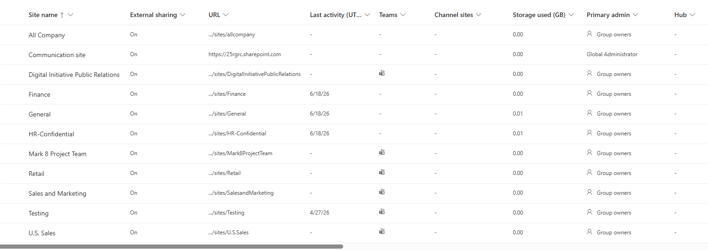
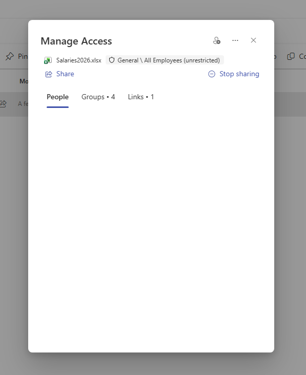
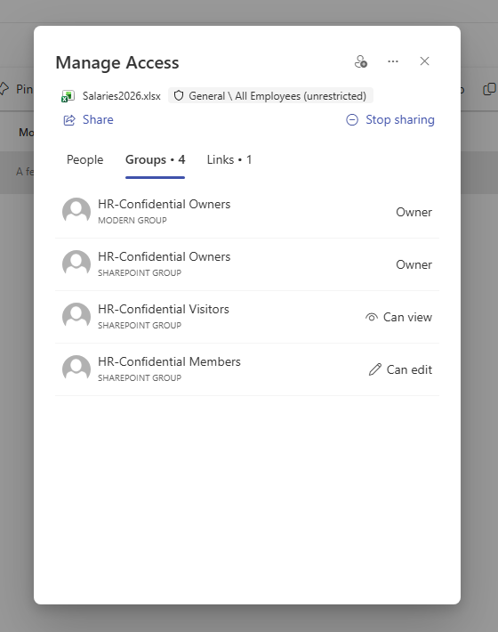

# 🏛️ Effective Access & Permissions Discovery — Assessment Record (CAR-02)

> ⚠️ **Disclaimer:** All data shown is fictitious and created in an isolated
> Microsoft 365 lab tenant for demonstration purposes only. No real personal,
> employee, or customer data is used.

> **Module:** M1 - Data Security | **Lab:** Lab 2 - Permissions Discovery
> **Date:** 2026-06-19 | **Author:** Wael Mohamed
> **Status:** Completed ✅

---

## 🎯 Context

Reviewing SharePoint site permissions alone is not enough to understand who can
truly access sensitive data. A site can appear "Private" and well-governed at the
permission level, while confidential files inside it remain broadly accessible
through sharing links or unrestricted access paths.

This lab maps the **effective access** to a confidential file in the HR-Confidential
site — combining site permissions, organizational access, and sharing links — to
reveal the hidden exposure Microsoft 365 Copilot would surface.

---

## 🧩 Approach

Used the SharePoint admin center and file-level **Manage Access** to inspect every
access layer for `Salaries2026.xlsx`.

| Access Layer | What Was Found | Risk |
|--------------|----------------|------|
| **Site permissions** | Defined Owner/Member groups, empty Visitors | ✅ Clean |
| **Organizational access** | "All Employees (unrestricted)" | 🟠 Broad |
| **Sharing link** | "People in MSFT with the link can view" | 🔴 Org-wide exposure |

---

## 🔍 Findings

- 🟢 **Site-level:** HR-Confidential has clean permissions — single Owner group,
  defined Members, no broad "Everyone" groups, empty Visitors.
- 🟠 **Org-level:** The file is associated with "All Employees (unrestricted)" access.
- 🔴 **File-level:** A sharing link ("People in MSFT with the link can view") makes
  the confidential salary file accessible to **any internal user**, bypassing the
  site's private permissions entirely.

---

## 💥 Why It Matters

> Effective access = site permissions + organizational access + sharing links.
> A confidential file can be exposed org-wide even when the site itself is Private.
> Reviewing only site permissions gives a **false sense of security** — and this is
> exactly the hidden exposure Microsoft 365 Copilot surfaces in natural-language queries.

---

## 🛠️ Environment

| Component | Detail |
|-----------|--------|
| Tenant | Microsoft 365 **E5** (lab) |
| Workloads | SharePoint Online, Microsoft Entra |
| Target | HR-Confidential site / Salaries2026.xlsx |
| Tools | SharePoint Admin Center, File-level Manage Access |

---

## 📸 Evidence

### 1️⃣ External Sharing Enabled on All Sites

### 2️⃣ HR-Confidential Site Permissions (Clean)

### 3️⃣ File Access — Groups Layer

### 4️⃣ File Access — Sharing Link (Org-wide Exposure)

---

## 🚀 Next Steps

- [ ] Run SharePoint Data Access Governance reports to detect this org-wide (CAR-03)
- [ ] Remediate: remove org-wide link, apply Sensitivity Labels & DLP

---

## 🧠 Skills Demonstrated

`Effective Access Analysis` · `SharePoint Permissions` · `Sharing Link Review` · `Copilot Readiness` · `Data Security`
