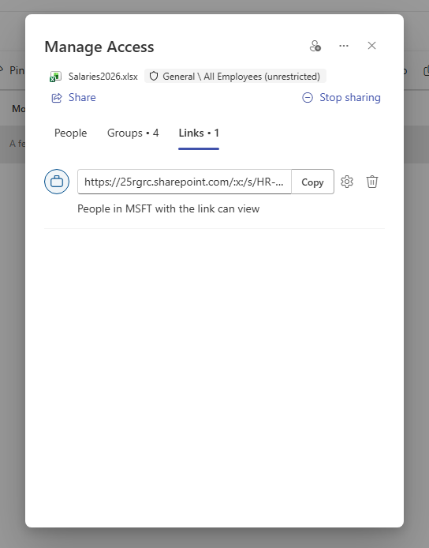

# 🏛️ Effective Access & Permissions Discovery — Assessment Record (CAR-02)

> ⚠️ **Disclaimer:** All data shown is fictitious and created in an isolated
> Microsoft 365 lab tenant for demonstration purposes only. No real personal,
> employee, or customer data is used.

> **Module:** M1 - Data Security  
> **Lab:** Lab 2 - Permissions Discovery  
> **Date:** 2026-06-19  
> **Author:** Wael Mohamed  
> **Status:** Completed ✅

---

## 🎯 Context

Reviewing SharePoint site permissions alone is not enough to understand who can truly access sensitive data.

A site can appear **Private** and well-governed at the permission level, while confidential files inside it remain broadly accessible through file-level sharing links or unrestricted organizational access paths.

This lab maps the **effective access** to a confidential file in the `HR-Confidential` site — combining:

- Site permissions
- Organizational access
- File-level access
- Sharing links

The objective is to reveal hidden exposure patterns that Microsoft 365 Copilot could make easier to discover through natural-language interaction.

Microsoft 365 Copilot respects existing Microsoft 365 permissions. The concern is not Copilot bypassing access controls, but Copilot surfacing content that was already accessible due to oversharing or weak governance. 【1-fba6a4】

---

## 🎯 Objective

Identify the true effective access paths to a confidential salary file and determine whether a private SharePoint site still contains file-level exposure risks.

This assessment focuses on:

- Site-level permissions
- File-level permissions
- Group-based access
- Org-wide sharing links
- Hidden exposure that may affect Copilot readiness

---

## 🧩 Scope

### In Scope

- SharePoint site permission review
- File-level Manage Access review
- Sharing link inspection
- Effective access assessment
- Evidence collection
- Copilot readiness risk explanation

### Out of Scope

- Production tenant review
- Real employee data
- Tenant-wide automated reporting
- Full DLP implementation
- Full remediation workflow
- Legal or regulatory compliance opinion

---

## ⚖️ Constraints

### Budget Constraint

The assessment assumes the organization wants to identify high-risk access paths using existing Microsoft 365 and SharePoint capabilities before investing in advanced governance tooling.

### Deadline Constraint

Permissions discovery is often required before a Copilot pilot, so the assessment must quickly identify whether sensitive files are truly restricted or only appear restricted at the site level.

### User Resistance

Site owners and business users may believe the site is safe because it is marked as Private, and may resist deeper file-level review unless the risk is clearly explained.

### Operational Constraint

Effective access can be difficult to understand because permissions may exist at multiple layers: site, group, file, link, and organizational sharing configuration.

---

## 🪪 License Considerations

### Current Lab License

Microsoft 365 E5 lab tenant.

### E3 Fit

A Microsoft 365 E3 environment can support manual review of SharePoint permissions, site membership, sharing links, and file-level Manage Access.

### E5 / Add-on Justification

E5 or advanced add-ons may be justified if the organization needs tenant-wide visibility, advanced data governance, automated reporting, sensitivity labeling at scale, DLP, insider risk signals, or advanced audit/compliance workflows.

### Cost Justification

Before recommending advanced licensing, the consultant should first determine whether manual review is sufficient.

Advanced licensing may be justified when:

- The organization has many SharePoint sites
- Sensitive data exists across many locations
- Copilot rollout is planned soon
- Manual review cannot scale
- Leadership needs repeatable reports
- Compliance requires stronger evidence

### Trade-off

Manual review lowers cost but may miss hidden exposure at scale.  
Advanced tooling improves visibility and repeatability but requires clear risk-based justification.

---

## 🧩 Approach

Used the SharePoint admin center and file-level **Manage Access** to inspect every access layer for `Salaries2026.xlsx`.

| Access Layer | What Was Found | Risk |
|--------------|----------------|------|
| **Site permissions** | Defined Owner/Member groups, empty Visitors | ✅ Clean |
| **Organizational access** | “All Employees (unrestricted)” | 🟠 Broad |
| **Sharing link** | “People in MSFT with the link can view” | 🔴 Org-wide exposure |

---

## 🔍 Findings

- 🟢 **Site-level:** `HR-Confidential` has clean permissions — single Owner group, defined Members, no broad “Everyone” groups, and empty Visitors.
- 🟠 **Org-level:** The file is associated with “All Employees (unrestricted)” access.
- 🔴 **File-level:** A sharing link — “People in MSFT with the link can view” — makes the confidential salary file accessible to any internal user who has the link.
- 🔴 **Key Risk:** The site appears private, but the file is still effectively exposed through a sharing link.

---

## 💥 Why It Matters

> Effective access = site permissions + organizational access + sharing links.

A confidential file can be exposed org-wide even when the SharePoint site itself is Private.

Reviewing only site permissions gives a **false sense of security**.

This is exactly the type of hidden exposure that becomes more important before Microsoft 365 Copilot adoption, because users may discover content more easily if they already have access through broad permissions or sharing links. 【1-fba6a4】

---

## 🧠 Consultant Thinking

This assessment proves that permission reviews must go deeper than site-level membership.

A consultant should not conclude that a sensitive site is safe just because:

- The site is private
- Visitors group is empty
- Only expected Owners and Members appear at site level

The real question is:

> Who can actually access the file?

For Copilot readiness, the consultant must assess access at multiple layers:

1. Site permissions
2. Microsoft 365 group membership
3. File-level permissions
4. Sharing links
5. External sharing settings
6. Organizational links
7. Data classification and labels

---

## 🛠️ Environment

| Component | Detail |
|-----------|--------|
| Tenant | Microsoft 365 **E5** lab |
| Workloads | SharePoint Online, Microsoft Entra |
| Target | `HR-Confidential` site / `Salaries2026.xlsx` |
| Tools | SharePoint Admin Center, File-level Manage Access |
| Scenario type | Effective access / Copilot readiness assessment |

---

## 📸 Evidence

### 1️⃣ External Sharing Enabled on All Sites

### 2️⃣ HR-Confidential Site Permissions — Clean

### 3️⃣ File Access — Groups Layer

### 4️⃣ File Access — Sharing Link / Org-wide Exposure

---

## 👥 Explain Like

### CISO

The site appears private, but the confidential file still has a broader access path through an org-wide sharing link.  
This creates a hidden data exposure risk before Copilot adoption because Copilot may make already-accessible content easier to discover.

### IT Admin

Site permissions are clean, but file-level access shows an org-wide sharing link.  
The fix requires reviewing Manage Access, removing broad links, checking group access, and validating effective access again.

### Business User

The HR site may look private, but a file inside the site was shared in a way that allows many internal users to access it if they have the link.  
Sensitive files should only be shared with people who need them.

---

## 🚨 Failure Scenario

### What Can Break?

The organization approves Microsoft 365 Copilot rollout after reviewing only site permissions, without checking file-level links.

### Symptoms

- Sensitive file appears to be protected because the site is Private
- Internal users can still access the file through a sharing link
- Security team discovers exposure after the Copilot pilot begins
- Business owners lose confidence in the readiness process

### Root Cause

- Review focused only on site permissions
- File-level sharing links were ignored
- Organizational sharing settings were too broad
- No effective access validation was performed
- No data owner confirmed intended access

### Fix

1. Inspect file-level Manage Access.
2. Remove org-wide sharing links.
3. Confirm direct users and groups.
4. Validate whether “All Employees” access is required.
5. Review site and file sharing settings.
6. Apply sensitivity labels if content is sensitive.
7. Re-test effective access after remediation.

### Prevention

- Include file-level access review in
- Create access review process for sensitive sites
- Assign site and data owners
- Use sensitivity labels for confidential files
- Document evidence before and after remediation

---

## 🧯 Risk Register

| Risk | Severity | Impact | Recommended Action |
|------|----------|--------|--------------------|
| Private site with exposed file | High | False sense of security | Review file-level Manage Access |
| Org-wide sharing link | Critical | Any internal user with link may access file | Remove org-wide link |
| Broad organizational access | High | Overexposure of confidential content | Validate group and org access |
| No effective access process | Medium | Hidden exposure missed during readiness review | Add layered access review |
| Copilot rollout after site-only review | High | Sensitive content may become easier to discover | Complete effective access review before pilot |

---

## 🧭 Recommendations

1. Do not rely only on SharePoint site permissions.
2. Review file-level Manage Access for sensitive files.
3. Remove org-wide sharing links from confidential content.
4. Validate whether broad organizational access is required.
5. Assign data owners for sensitive files and sites.
6. Include effective access review in every Copilot readiness assessment.
7. Re-test access after remediation.
8. Document before/after evidence for audit and leadership reporting.

---

## 📌 Business Value

This assessment provides business value by:

- Revealing hidden exposure not visible at site level
- Reducing risk before Copilot rollout
- Helping IT understand true effective access
- Giving leadership evidence-based risk visibility
- Improving SharePoint governance
- Supporting secure AI adoption

---

## 🧪 Validation Performed

The assessment validated that:

- The SharePoint site appeared clean at the site-permission level.
- A confidential file still had broader access through organizational access and sharing links.
- File-level Manage Access is required to understand true exposure.
- Effective access review is a key part of Copilot readiness.

---

## 📚 Lessons Learned

- Private SharePoint sites can still contain exposed files.
- Site-level permissions are not enough for Copilot readiness.
- Org-wide sharing links can bypass the apparent privacy of the site.
- Effective access must include site, group, file, and link layers.
- Copilot readiness assessments must include file-level permissions discovery.

---

## 🎤 Interview Talking Points

### Question 1

**Why are site permissions not enough to assess data exposure?**

**Model Thinking:**  
Because access can exist at multiple layers. A site can be private, but a file inside the site may still have an org-wide sharing link or direct access that exposes it more broadly.

### Question 2

**What is effective access?**

**Model Thinking:**  
Effective access is the real access a user may have after combining site permissions, group permissions, file-level permissions, sharing links, and organizational access settings.

### Question 3

**How does this relate to Microsoft 365 Copilot readiness?**

**Model Thinking:**  
Copilot respects existing permissions. If a user already has access to content through hidden sharing links or broad access, Copilot may make that content easier to find. So effective access review is required before rollout.

### Question 4

**What would you do first in remediation?**

**Model Thinking:**  
I would remove org-wide sharing links from sensitive files, validate direct access, confirm business ownership, apply sensitivity labels, and re-test effective access.

---

## 🚀 Next Steps

- [x] Identify baseline oversharing patterns *(CAR-01)*
- [x] Review effective access and file-level exposure *(CAR-02)*
- [ ] Run SharePoint Data Access Governance reports to detect this org-wide *(CAR-03)*
- [ ] Remediate: remove org-wide link, apply Sensitivity Labels & DLP *(CAR-05)*
- [ ] Validate after remediation with Copilot Readiness Validation Simulation *(CAR-06)*

---

## 🧠 Skills Demonstrated

`Effective Access Analysis` · `SharePoint Permissions` · `Sharing Link Review` · `Copilot Readiness` · `Data Security` · `Microsoft 365 Governance` · `File-level Access Review` · `Risk Assessment` · `Consulting Documentation`
