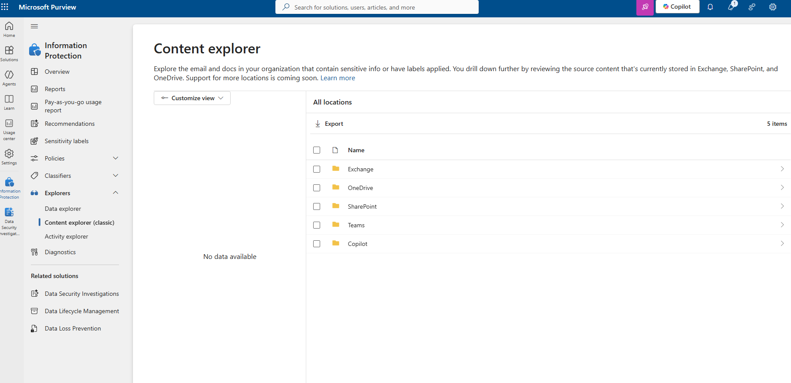
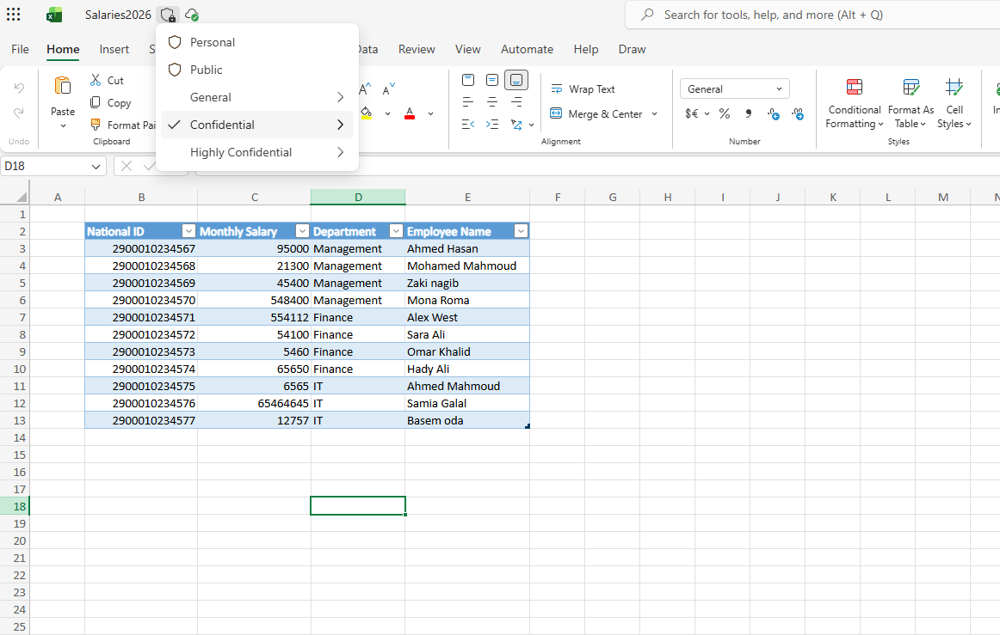
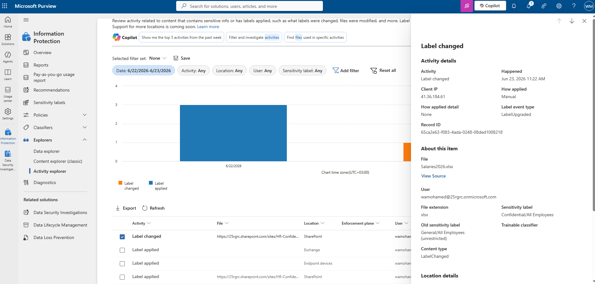
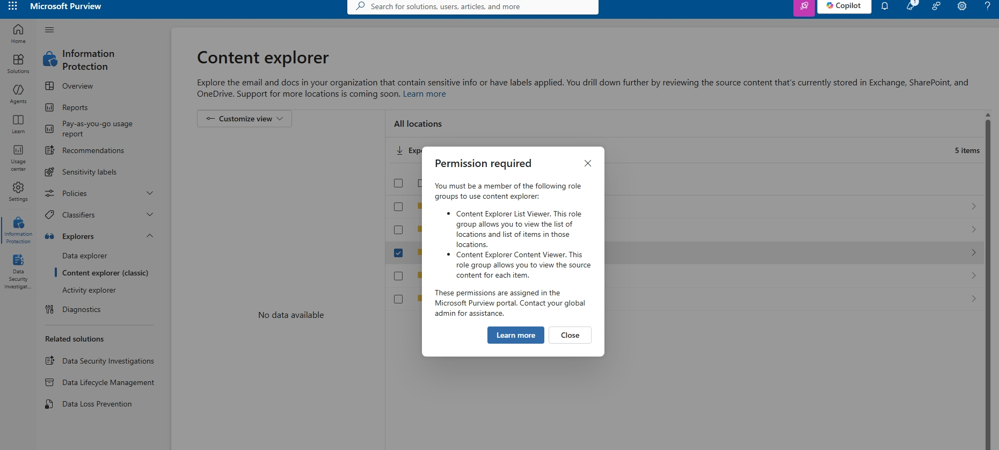
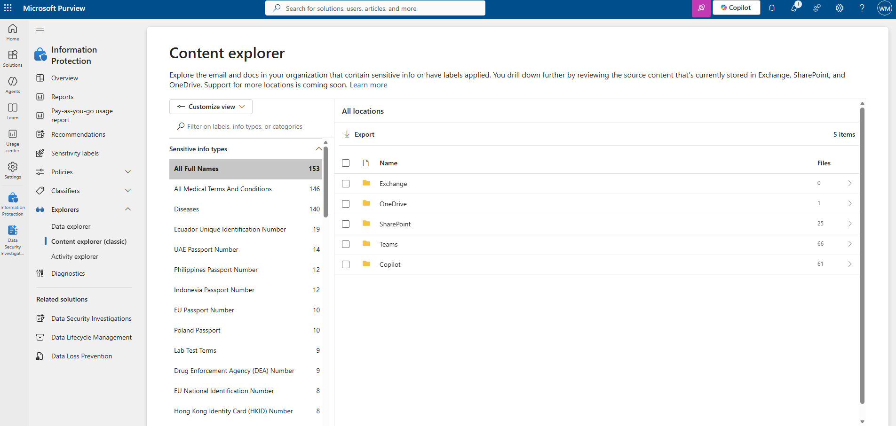
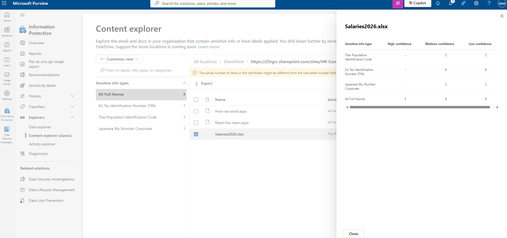

# 🏛️ Visibility Gap & Role Dependency — Assessment Record (CAR-03)

> ⚠️ **Disclaimer:** All data shown is fictitious and created in an isolated
> Microsoft 365 lab tenant for demonstration purposes only. No real personal,
> employee, or customer data is used.

> **Module:** M1 - Data Security  
> **Lab:** Lab 3 - Purview Visibility & Classification  
> **Date:** 2026-06-23  
> **Author:** Wael Mohamed  
> **Status:** Completed ✅

---

## 🎯 Context

After reproducing Microsoft 365 oversharing risks in **CAR-01** and mapping effective access in **CAR-02**, this lab focuses on a different but equally critical question:

> **Can the organization actually see where sensitive data exists?**

Microsoft 365 Copilot readiness is not only about permissions and sharing links.

Copilot readiness also depends on whether governance tools such as Microsoft Purview can discover, classify, and surface sensitive content across SharePoint, OneDrive, Teams, Exchange, and Copilot-related locations.

This lab investigates visibility gaps in Microsoft Purview and shows how classification and role assignments affect what administrators can detect.

Microsoft 365 Copilot respects existing Microsoft 365 permissions. The concern is not Copilot bypassing access controls, but Copilot surfacing content that was already accessible or poorly governed. 【1-eacdbd】

---

## 🎯 Objective

Assess whether Microsoft Purview can detect, classify, and surface sensitive data after oversharing and effective access issues were identified.

This assessment focuses on:

- Purview Content Explorer visibility
- Activity Explorer visibility
- Sensitivity label activity
- Role dependency for data visibility
- Sensitive information type detection
- Copilot readiness implications

---

## 🧩 Scope

### In Scope

- Microsoft Purview Content Explorer review
- Activity Explorer review
- Sensitivity label validation
- Role dependency analysis
- Sensitive information type discovery
- Visibility gap documentation
- Copilot readiness governance analysis

### Out of Scope

- Production tenant assessment
- Real employee or customer data
- Full DLP deployment
- Full sensitivity label rollout
- Legal compliance opinion
- Full tenant-wide remediation

---

## ⚖️ Constraints

### Budget Constraint

The assessment assumes the organization wants to use existing Microsoft Purview capabilities before investing in deeper governance automation or advanced compliance expansion.

### Deadline Constraint

Visibility assessment is required before a Copilot rollout decision. The organization needs to quickly determine whether sensitive data is discoverable, classified, and visible to the right administrators.

### User Resistance

Business and IT stakeholders may believe data protection exists because labels or admin roles are present, but may resist deeper role and visibility validation unless the gap is clearly demonstrated.

### Operational Constraint

Purview visibility depends on several factors, including classification, indexing, activity availability, supported workloads, and correct role assignment.

---

## 🪪 License Considerations

### Current Lab License

Microsoft 365 E5 lab tenant.

### E3 Fit

A Microsoft 365 E3 environment may support basic governance and manual review depending on the available features and tenant configuration.

### E5 / Add-on Justification

E5 or advanced compliance add-ons may be justified when the organization requires:

- Tenant-wide sensitive data visibility
- Advanced data classification
- Data loss prevention at scale
- Advanced audit and compliance workflows
- Insider risk signals
- Better evidence for compliance reviews
- Stronger Copilot readiness governance

### Cost Justification

Advanced licensing should not be recommended by default.

The justification should be based on:

- Volume of sensitive data
- Number of SharePoint/Teams/OneDrive locations
- Regulatory pressure
- Planned Copilot rollout timeline
- Manual review limitations
- Need for repeatable reporting
- Need for DLP and governance enforcement

### Trade-off

Manual visibility review lowers licensing cost but may miss sensitive data at scale.  
Advanced Purview capabilities improve discovery and governance but require clear business and risk justification.

---

## 🧩 Approach

| Step | Action | Purpose |
|------|--------|---------|
| 1 | Opened Microsoft Purview Content Explorer | Check tenant-wide visibility |
| 2 | Observed no visible data in Content Explorer | Identify visibility gap |
| 3 | Applied a Sensitivity Label manually to `Salaries2026.xlsx` | Create classification signal |
| 4 | Verified label activity in Activity Explorer | Confirm label event was recorded |
| 5 | Attempted to access Content Explorer details | Validate data visibility |
| 6 | Encountered missing role error | Identify role dependency |
| 7 | Added required Content Explorer roles | Enable visibility |
| 8 | Reopened Content Explorer | Validate sensitive data discovery |
| 9 | Reviewed detected sensitive information types | Analyze detection quality |

---

## 🔍 Findings

### 1️⃣ Initial Visibility Gap

At the beginning of the assessment, Content Explorer showed:

> `No data available`

This happened despite the tenant containing a confidential file:

> `Salaries2026.xlsx`

The file contained fictitious salary data, employee names, departments, and ID-like numbers.

### Key Insight

Sensitive data can exist in the tenant while governance visibility remains limited or unavailable.

---

### 2️⃣ Classification Dependency

A Sensitivity Label was manually applied to the file:

> `Confidential`

Activity Explorer later confirmed label activity for the file:

| Field | Value |
|-------|-------|
| Activity | Label changed |
| File | `Salaries2026.xlsx` |
| How applied | Manual |
| Sensitivity label | Confidential / All Employees |
| Old sensitivity label | General / All Employees unrestricted |

### Key Insight

Applying labels creates an important classification signal, but labeling alone does not always produce immediate visibility in Content Explorer.

---

### 3️⃣ Activity Visibility vs Data Visibility

Activity Explorer successfully showed that a label was applied.

However, Content Explorer initially remained inaccessible or empty.

| Tool | What It Shows | Status |
|------|---------------|--------|
| **Activity Explorer** | User and label activity | ✅ Visible |
| **Content Explorer** | Where sensitive data exists | ❌ Initially blocked |

### Key Insight

Having visibility into activity does not guarantee visibility into data.

---

### 4️⃣ Role Dependency Gap

When attempting to inspect Content Explorer details, Microsoft Purview displayed a permission error requiring:

- Content Explorer List Viewer
- Content Explorer Content Viewer

This showed that broad administrative access alone was not enough to access all Content Explorer data.

### Key Insight

Full visibility in Purview requires the correct role assignments, not only broad administrative privileges.

---

### 5️⃣ Visibility Restored After Role Assignment

After assigning the required Content Explorer roles, Content Explorer became accessible and started showing sensitive information discovery across the tenant.

Content Explorer showed sensitive information distributed across multiple Microsoft 365 locations:

| Location | Files |
|----------|-------|
| Exchange | 0 |
| OneDrive | 1 |
| SharePoint | 25 |
| Teams | 66 |
| Copilot | 61 |

### Key Insight

Once roles and classification signals were in place, Microsoft Purview was able to surface sensitive data visibility across the organization.

---

### 6️⃣ Sensitive Information Types Detected

Content Explorer displayed several detected sensitive information types, including:

- All Full Names
- All Medical Terms And Conditions
- Diseases
- Ecuador Unique Identification Number
- UAE Passport Number
- Philippines Passport Number
- Indonesia Passport Number
- EU Passport Number
- Poland Passport
- Lab Test Terms
- Drug Enforcement Agency DEA Number
- EU National Identification Number
- Hong Kong Identity Card HKID Number

For the file `Salaries2026.xlsx`, Purview detected sensitive information such as:

- Thai Population Identification Code
- EU Tax Identification Number TIN
- Japanese My Number Corporate
- All Full Names

Detection confidence varied across high, medium, and low confidence levels.

### Key Insight

Purview can detect sensitive-looking patterns automatically, but detected sensitive information types may require analyst review and tuning to reduce false positives.

[Inference] Because the lab file contained fictitious ID-like numeric patterns, Microsoft Purview matched those patterns against multiple built-in sensitive information types from different countries. This indicates the importance of reviewing confidence levels and detection context before making governance decisions.

---

## 💥 Why It Matters

> You cannot secure what you cannot see.  
> You also cannot reliably see sensitive data without classification, indexing, and the correct Microsoft Purview roles.

Copilot readiness requires more than checking licenses or assigning Copilot to users.

Organizations must validate:

- Where sensitive data exists
- Whether data is classified
- Whether Purview can detect it
- Whether administrators have the right roles to investigate it
- Whether detections are accurate enough to support remediation decisions

Microsoft 365 Copilot respects existing access controls, so weak visibility and weak governance can increase readiness risk before rollout. 【1-eacdbd】

---

## 🧠 Consultant Thinking

This assessment demonstrates that Copilot readiness requires **visibility validation**, not only permissions review.

A consultant should not assume that the tenant is ready because:

- A file has a sensitivity label
- A compliance admin role exists
- Activity Explorer shows label activity
- SharePoint permissions were already reviewed

The real consulting question is:

> Can the organization identify sensitive data locations, validate detection quality, and assign the right people to investigate and remediate?

This record also shows the importance of **role design**. Broad admin roles do not always equal data visibility inside Purview. The required viewer roles must be assigned intentionally and securely.

---

## 🛠️ Environment

| Component | Detail |
|-----------|--------|
| Tenant | Microsoft 365 E5 lab tenant |
| Workloads | SharePoint Online, OneDrive, Teams, Exchange, Copilot |
| Tools | Microsoft Purview Content Explorer, Activity Explorer, Sensitivity Labels |
| Target file | `Salaries2026.xlsx` |
| Data type | Fictitious salaries, names, departments, and ID-like numbers |
| Scenario type | Purview visibility / Copilot readiness / role dependency |

---

## 📸 Evidence

### 1️⃣ Content Explorer — Initial No Data Available

### 2️⃣ Sensitivity Label Applied to Salaries2026.xlsx

### 3️⃣ Activity Explorer — Label Changed Event

### 4️⃣ Content Explorer — Permission Required

### 5️⃣ Content Explorer — Tenant-Wide Sensitive Data Visibility

### 6️⃣ Content Explorer — Salaries2026.xlsx Sensitive Info Detection

> Note: Some detected sensitive information types may represent false positives due to pattern-based recognition, especially in lab or synthetic datasets. Further validation is required in real environments.

---

## 👥 Explain Like

### CISO

The organization may have sensitive data in Microsoft 365 but lack visibility into where that data exists.  
Before enabling Copilot broadly, leadership needs confidence that sensitive data can be discovered, classified, reviewed, and remediated data exists. Correct Purview role assignment is required for visibility.

### Business User

Sensitive files may be stored in different Microsoft 365 locations.  
The organization needs tools and permissions to identify sensitive information so it can be protected before broader AI usage.

---

## 🚨 Failure Scenario

### What Can Break?

The organization starts a Copilot rollout assuming sensitive data is governed because labels exist, but Purview visibility is incomplete due to missing roles or detection gaps.

### Symptoms

- Content Explorer shows no data or limited data
- Compliance team cannot inspect sensitive data locations
- Activity Explorer shows events, but data locations remain unclear
- Copilot rollout proceeds without complete visibility
- Sensitive data issues are discovered late

### Root Cause

- Content Explorer roles not assigned
- Classification and visibility assumptions not validated
- Activity visibility confused with data visibility
- Sensitive information detections not reviewed
- No visibility validation step in Copilot readiness process

### Fix

1. Verify Purview roles required for Content Explorer.
2. Assign Content Explorer List Viewer and Content Viewer roles to approved reviewers.
3. Validate Activity Explorer and Content Explorer separately.
4. Confirm label policy scope and publishing status.
5. Review sensitive information type matches.
6. Identify false positives and tune where needed.
7. Combine Purview findings with SharePoint permission findings.

### Prevention

- Include Purview visibility validation in Copilot readiness assessment
- Create least-privilege role assignment model
- Maintain reviewer access governance
- Validate sensitive information detection quality
- Document evidence before rollout
- Review visibility after label or policy changes

---

## ⚠️ Key Risks Identified

| Risk | Explanation | Severity | Recommended Action |
|------|-------------|----------|--------------------|
| Visibility Gap | Sensitive data existed but was not initially visible in Content Explorer | High | Validate Purview visibility before Copilot rollout |
| Role Dependency | Missing Content Explorer roles blocked access to data insights | High | Assign required roles using least privilege |
| Delayed Visibility | Labeling does not always result in instant Content Explorer visibility | Medium | Allow time for indexing and validate again |
| Partial Governance View | Activity was visible, but data location visibility was initially restricted | Medium | Review Activity Explorer and Content Explorer separately |
| Detection Noise | Built-in SITs may match synthetic or generic numeric patterns | Medium | Review confidence and context before action |
| Copilot Rollout Without Visibility | AI adoption begins before sensitive data locations are understood | High | Complete visibility and permissions assessment first |

---

## 🧭 Recommendations

1. Validate Microsoft Purview role assignments before data discovery assessments.
2. Distinguish Activity Explorer visibility from Content Explorer visibility.
3. Confirm sensitivity label publishing and policy scope.
4. Use Content Explorer to identify sensitive data locations.
5. Review sensitive information type matches for false positives.
6. Combine Purview findings with SharePoint effective access review.
7. Assign data owners for sensitive locations.
8. Build a 30/60/90 remediation roadmap for Copilot readiness.
9. Use least privilege for Purview visibility roles.
10. Re-test visibility after remediation and role changes.

---

## 📌 Business Value

This assessment provides business value by:

- Revealing governance visibility gaps before Copilot rollout
- Ensuring sensitive data can be discovered and reviewed
- Improving confidence in Microsoft Purview readiness
- Reducing risk of hidden sensitive data exposure
- Helping justify role and licensing decisions
- Supporting a safer Microsoft 365 Copilot adoption roadmap

---

## 🧪 Validation Performed

The assessment validated that:

- Sensitive files can exist while Content Explorer initially shows no data.
- Applying sensitivity labels creates activity signals.
- Activity Explorer and Content Explorer provide different visibility layers.
- Content Explorer requires specific roles for detailed visibility.
- Purview can detect sensitive information across multiple Microsoft 365 locations.
- Sensitive information type matches require review and tuning.

---

## 📚 Lessons Learned

- Labels are not just for protection; labels are also a foundation for visibility.
- Activity visibility and content visibility are separate capabilities in Purview.
- Correct role assignment is required before performing a tenant-wide data assessment.
- Content Explorer can reveal sensitive information across SharePoint, Teams, OneDrive, Exchange, and Copilot locations.
- Sensitive information detection must be reviewed carefully to separate true findings from pattern-based false positives.
- Copilot readiness requires classification, visibility, permissions review, and remediation planning.

---

## 🎤 Interview Talking Points

### Question 1

**Why is Purview visibility important before Microsoft 365 Copilot rollout?**

**Model Thinking:**  
Because Copilot readiness depends on knowing where sensitive data exists and whether governance controls can discover and classify that data. Without visibility, the organization may roll out Copilot while sensitive data remains unmanaged.

### Question 2

**What is the difference between Activity Explorer and Content Explorer?**

**Model Thinking:**  
Activity Explorer shows user and label activity. Content Explorer helps identify where sensitive data exists. Seeing activity does not mean the organization has full visibility into data locations.

### Question 3

**Why are Purview roles important?**

**Model Thinking:**  
Some Purview data visibility features require specific roles. A broad admin role may not provide the right level of visibility for content inspection. The correct roles should be assigned using least privilege.

### Question 4

**How would you handle false positives in sensitive information detection?**

**Model Thinking:**  
I would review confidence levels, sample matches, context, file type, and business relevance before treating detections as confirmed findings. Then I would tune SITs, labels, or DLP policies as needed.

### Question 5

**Would you recommend E5 immediately?**

**Model Thinking:**  
Not automatically. I would first assess current visibility, volume of sensitive data, compliance requirements, manual review limitations, and Copilot rollout timeline. E5 or add-ons should be justified based on risk and operational need.

---

## 🚀 Next Steps

- [x] Identify baseline oversharing patterns *(CAR-01)*
- [x] Review effective access and file-level exposure *(CAR-02)*
- [x] Identify Purview visibility and role dependency gaps *(CAR-03)*
- [ ] Validate sensitivity label publishing and label policy scope
- [ ] Create controlled label taxonomy for Public, Internal, Confidential, and Highly Confidential data
- [ ] Use Microsoft Purview DLP to test enforcement against sensitive data exposure
- [ ] Tune sensitive information detection to reduce false positives
- [ ] Combine Content Explorer findings with SharePoint sharing and effective access review
- [ ] Build 30/60/90 remediation roadmap for Copilot readiness
- [ ] Continue with admin resilience and break-glass review *(CAR-04)*

---

## 🧠 Skills Demonstrated

`Microsoft Purview` · `Content Explorer` · `Activity Explorer` · `Sensitivity Labels` · `Data Classification` · `Role-Based Access Control` · `Copilot Readiness` · `Sensitive Information Detection` · `Data Governance` · `Security & Compliance Consulting` · `Microsoft 365 Risk Assessment`
