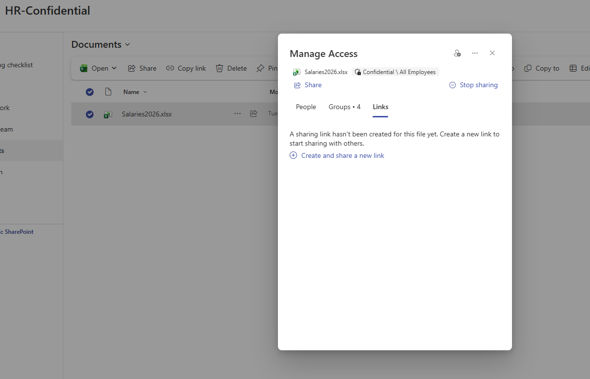
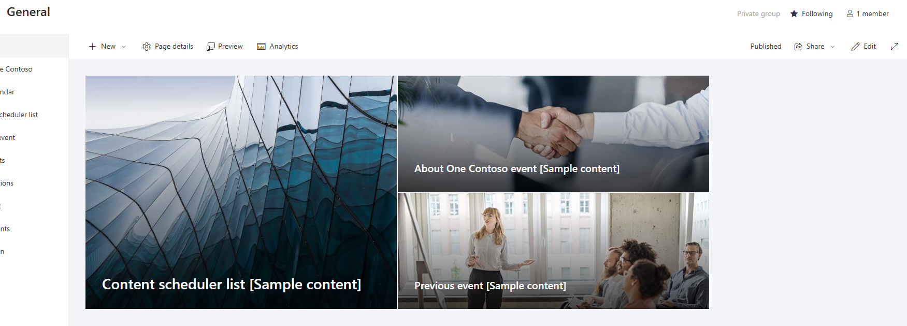
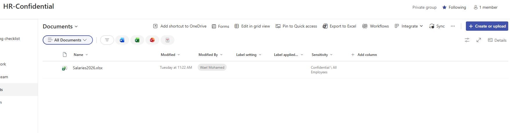
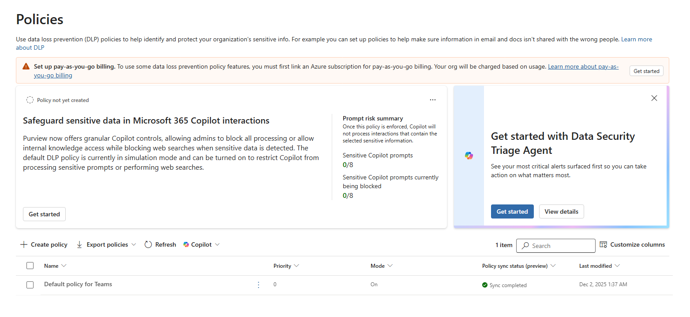

# 🛠️ Oversharing Remediation & Risk Reduction — Assessment Record (CAR-05)

> ⚠️ **Disclaimer:** All data shown is fictitious and created in an isolated Microsoft 365 lab tenant for demonstration purposes only. No real personal, employee, or customer data is used.

> **Module:** M1 - Data Security & Identity | **Lab:** Lab 5 - Oversharing Remediation
> **Date:** 2026-06-25 | **Author:** Wael Mohamed | **Status:** Completed ✅

---

## 🎯 Context

The first four labs **found** the problems — oversharing (CAR-01), effective access (CAR-02), visibility gaps (CAR-03), and admin resilience risks (CAR-04).

This lab focuses on the **fix**: reducing the data exposure risks discovered so Microsoft 365 Copilot can be enabled **safely**. The goal is to turn findings into concrete, low-risk remediation — and to learn how layered remediation really works in practice.

---

## 🧩 Approach

Remediated the highest-risk findings from CAR-01 to CAR-04, starting with the fastest "Quick Wins."

| Step | Action | Target |
|------|--------|--------|
| **Remove link** | Deleted the org-wide sharing link | `Salaries2026.xlsx` |
| **Lock site** | Changed site privacy `Public → Private` | `General` site |
| **Verify label** | Confirmed Sensitivity Label protects the file | `Salaries2026.xlsx` |
| **Assess DLP** | Evaluated DLP policy creation requirements | Tenant-wide |

---

## 🔧 Remediation Performed

**1. Removed Org-Wide Sharing Link**
The confidential salary file was shared via a *"People in org with link can view"* link. The link was **deleted** — the file is no longer discoverable org-wide through it.

**2. Locked Down the Public Site**
The `General` site was **Public** (anyone in the org could access). Changed to **Private**, so only members can reach its content.

**3. Verified Sensitivity Label Protection**
`Salaries2026.xlsx` now carries the **Confidential** label (Sensitivity: *Confidential \ All Employees*). Protection now **travels with the file** even if it's moved or re-shared.

---

## 🔍 Findings During Remediation

- 🟠 **Medium:** The confidential file remained reachable through **additional access layers** (groups + label-based access) even after the org-wide link was removed — confirming the *Effective Access* principle from CAR-02.
- 🔵 **Informational:** **DLP policy creation requires pay-as-you-go billing** or a linked Azure subscription — enforcement isn't available by default.

### 💡 Key Insight — DLP Licensing Dependency
Creating enforced DLP policies in this tenant requires **pay-as-you-go billing** or a linked Azure subscription.
- **Risk:** Organizations assume data protection is on by default; some DLP enforcement features depend on **additional licensing/billing**.
- **Recommendation:** Plan licensing costs (pay-as-you-go or E5 Compliance) as part of **Copilot readiness budgeting** *before* relying on DLP enforcement.

---

## ❓ Why It Matters

> Remediation is **layered, not a single switch**. Removing one sharing link does **not** fully secure a file — *Effective Access* (CAR-02) means groups, organizational access, and labels must **all** be reviewed.
>
> **Sensitivity Labels** provide protection that travels with the data — making them the most **durable** control when DLP isn't yet licensed.

---

## ⚠️ Key Risks Identified

| Risk | Severity | Impact |
|------|----------|--------|
| Residual access via groups/label after link removal | 🟠 Medium | File still reachable beyond the removed link |
| DLP enforcement requires billing | 🔵 Info | False sense of "protected by default" |
| Remediation done piecemeal (one layer only) | 🟡 Low | Incomplete risk reduction |

---

## 📌 Recommendations

1. Review **all** access layers (links + groups + organizational access) when remediating — not just sharing links.
2. Use **Sensitivity Labels** as the baseline protection (travels with the file).
3. **Plan licensing/billing** before relying on DLP enforcement.
4. **Re-run Data Access Governance** reports after remediation to confirm risk reduction.
5. Stage remediation as **Quick Wins** (links, site privacy) → then **Strategic** (labels, DLP).

---

## 🖥️ Environment

| Component | Detail |
|-----------|--------|
| Tenant | Microsoft 365 **E5** (lab) |
| Workloads | SharePoint Online · Microsoft Purview |
| Target | HR-Confidential / General sites · `Salaries2026.xlsx` |
| Tools | SharePoint sharing · Site privacy · Sensitivity Labels · Purview DLP |

---

## 📸 Evidence

| # | Screenshot | Shows |
|---|-----------|-------|
| 1 |  | Org-wide sharing link removed |
| 2 |  | Site changed to Private group |
| 3 |  | Confidential label on salary file |
| 4 |  | DLP billing dependency |

---

## 🚀 Next Steps

- Complete **DLP enforcement** once billing is arranged.
- Enable Copilot and **re-test** that the file is no longer surfaced → **CAR-06: Copilot Live Validation**.

---

## 🧠 Skills Demonstrated

`Oversharing Remediation` · `Sensitivity Labels` · `SharePoint Sharing Controls` · `Microsoft Purview` · `Copilot Readiness` · `Layered Access Review`
